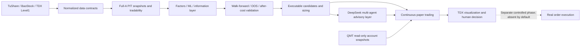

# QuantPilot-AI-Next

[Overview / 总览](README.md) · [简体中文](README.zh-CN.md) · [English](README.en.md)

[](https://github.com/Atlas2005/QuantPilot-AI-Next/actions/workflows/ci.yml)


> A profit-evidence-first AI quant research and manual decision-support platform for China A-shares. It connects real data, explicit A-share trading constraints, reproducible evaluation, AI multi-agent analysis, continuous paper trading, and Windows/TongDaXin workflows behind auditable boundaries.

**Status updated: August 15, 2026.** The project has moved far beyond its original skeleton, but it remains a research, paper-trading, and manual decision-support system—not a proven-profitable autonomous live-trading product. Development paused at the August 3 runtime-stability checkpoint. See [Current Project State](docs/CURRENT_PROJECT_STATE.md) for the exact resume sequence.

## What the project is trying to solve

QuantPilot-AI-Next is not an attempt to build an impressive-looking “AI stock bot.” It is an attempt to build an A-share decision pipeline that can be reproduced, challenged, and falsified:

1. Acquire and normalize real A-share data while preserving point-in-time (PIT) and provenance evidence.
2. Model T+1, 100-share lots, price limits, suspensions, fees, slippage, liquidity, holdings, and account constraints explicitly.
3. Select factors, models, and strategies using out-of-sample, walk-forward, after-cost, benchmark, and ablation evidence.
4. Reduce custom-backtest bias through adapters or comparisons with mature frameworks such as Qlib, VectorBT, and RQAlpha.
5. Use DeepSeek multi-agent analysis for structured research and risk opinions while retaining deterministic fallbacks, call budgets, and a complete audit trail.
6. Send qualified candidates to continuous paper trading, TongDaXin visualization, and a manual execution workflow. Any real order route must remain a separate, controlled, reversible phase.

## Current state: three layers that must not be confused

| Layer | Branch / checkpoint | State | Defensible conclusion |
|---|---|---|---|
| Default GitHub baseline | `main`; functional baseline `8c232f2` | Merged and covered by CI | Public entry point; research, data, paper, Windows, QMT read-only bridge, and TDX Level1 capabilities through PR #130 |
| Completed next feature baseline | `feat/tdx-prediction-integration-v1` at `3e76235` | 15 subsequent feature/fix commits; implemented and tested, not merged into `main` | Adds TDX prediction replay/live shadow, trained probabilities, human experience, daily full-A production input, seven DeepSeek desks, and the manual trading system |
| Pre-pause WIP | `fix/tdx-runtime-stability-v1` at `baf992c` | Latest checkpoint; **awaiting code review and Windows acceptance** | Adds single-instance locking, reconnect suppression, clean shutdown, empty TQ argument, and TDX V6.06 formula compatibility fixes; it is not a release |

The latest WIP checkpoint passes the complete local suite with **2170 passed, 6 skipped**. That proves the automated suite passed. It does not prove profitability or replace Windows acceptance, long-horizon paper evidence, or out-of-sample returns.

## What is implemented

### 1. Data and A-share market reality

- TuShare primary data paths, BaoStock fallback/cross-validation paths, and a TongDaXin Level1 live-market adapter.
- Full-A-share Parquet snapshots, atomic storage, partition validation, exchange calendars, PIT listing dates, and historical symbol-transition handling.
- Suspension, price-limit, ST, volume, price, and tradability metadata enrichment.
- A-share T+1, lot-size, fee, stamp-duty, slippage, liquidity, position, and account constraints.
- Explicit validation for provider failure, latency, stale data, and provenance.

### 2. Research, factors, and validation

- Deterministic factor ranking, after-cost baselines, turnover optimization, ML factor training, and robust walk-forward ranking.
- OOS/walk-forward evaluation, ablation, benchmark comparison, attribution, and profitability smoke tests.
- Qlib signal/offline workflow trials, VectorBT replay comparisons, and RQAlpha A-share adapter reviews.
- Executable-candidate filtering, tradability, cost estimation, sizing, and fill simulation.

### 3. AI decisions and feedback loops

- DeepSeek multi-agent contracts, runtime routing, structured JSON evidence, and physical-call/cost limits.
- Announcement/information layers, research-committee and quant-firm roles, plus incremental AI ablation.
- Multi-day paper replay, daily evaluation, continuous paper trading, and a PostgreSQL/Prefect/Grafana control center.
- AI is primarily advisory/shadow logic today. A model failure must not silently erase the deterministic candidate set.

### 4. Windows, TongDaXin, and broker boundaries

- Repeatable Windows runtime bootstrap, DPAPI-backed secrets, Runtime Doctor, and lifecycle scripts.
- A QMT built-in Python **read-only** account/position/order/trade snapshot bridge. The broker provider is disabled by default.
- A TongDaXin manual-signal bridge, QPTY/`QP候选` block publishing, and Level1 subscriptions.
- The next feature baseline implements TDX prediction replay, live shadow, human markers, and an after-close/intraday/end-of-day manual workflow.

## What is not complete—and must not be misrepresented

- **There is no credible proof of profitability.** A one-day holdout, passing tests, or a backtest curve is not long-horizon out-of-sample after-cost evidence.
- **The latest TDX runtime-stability fixes have not passed final Windows acceptance and are not merged into the default branch.**
- **There is no autonomous live-order path enabled by default.** The QMT bridge on `main` is read-only; any order-writing path requires a separate review.
- There is no formal version tag or GitHub Release. Treat the repository as research software for reviewers, not a stable SDK/product dependency.
- The repository currently has no explicit license file. Do not assume unrestricted commercial redistribution rights until a license is selected.

## Architecture



The governing rule is simple: a model cannot bypass data contracts, A-share rules, validation gates, API budgets, or the human/broker boundary.

## Quick start

### 1. Clone and run the baseline suite

```bash
git clone https://github.com/Atlas2005/QuantPilot-AI-Next.git
cd QuantPilot-AI-Next
python3.11 -m venv .venv
source .venv/bin/activate
python -m pip install --upgrade pip
python -m pip install -e ".[dev]"
python -m pytest -q
```

On Windows PowerShell:

```powershell
py -3.12 -m venv .venv
.\.venv\Scripts\Activate.ps1
python -m pip install --upgrade pip
python -m pip install -e ".[dev]"
python -m pytest -q
```

### 2. Install only the optional capability you need

| Use case | Install command | External requirement |
|---|---|---|
| Full-A snapshots | `python -m pip install -e ".[all-a-share]"` | Real fetches require `TUSHARE_TOKEN` in the environment |
| VectorBT replay | `python -m pip install -e ".[replay]"` | Local or properly licensed data |
| ML evaluation | `python -m pip install -e ".[ml]"` | LightGBM |
| Continuous paper | `python -m pip install -e ".[continuous-paper]"` | PostgreSQL / Prefect; the full Windows runtime uses Docker |
| Windows runtime | `python -m pip install -e ".[windows-runtime]"` | 64-bit Windows and Python 3.12; TongDaXin/QMT are optional |

The `live-ai` extra and the validated real DeepSeek HTTP path live on the unmerged `feat/tdx-prediction-integration-v1` branch. Pin that checkpoint and read its manual-system documentation before installing `.[live-ai]`. Real-data, model, and broker credentials must be supplied only through environment variables or encrypted local runtime files. Never commit tokens, account identifiers, snapshots, or generated runtime data.

### 3. Discover the available entry points before enabling real data

```bash
python scripts/run_factor_ranking_baseline_v1.py --help
python scripts/run_real_data_walk_forward_smoke.py --help
python scripts/run_real_candidate_daily_paper_v1.py --help
python scripts/run_continuous_paper_cycle_v1.py --help
python scripts/all_a_share_snapshot_v1.py --help
```

The repository does not bundle redistributable real-market datasets. Run the tests and fixture paths first, then enable real-data modes explicitly using each command's `--help` and its linked documentation.

### 4. Validate the Windows runtime

Start with a no-state-change prerequisite check that makes no provider call:

```powershell
powershell -NoProfile -ExecutionPolicy Bypass -File .\scripts\bootstrap_windows_runtime_v1.ps1 -ValidateOnly -NonInteractive -SkipDocker
```

After reviewing the requirements, follow [Windows Runtime](docs/windows_runtime.md) to provision an isolated runtime home, Docker services, DPAPI secrets, and optional TDX or QMT read-only integration.

### 5. Review the newest manual system

This workflow is not on the default branch. Reviewers should pin the completed feature checkpoint instead of treating WIP as a release:

```bash
git fetch origin --prune
git switch feat/tdx-prediction-integration-v1
git rev-parse --short HEAD   # expected: 3e76235
```

Then read `docs/quantpilot_manual_system_v1.md` on that branch. Test `fix/tdx-runtime-stability-v1` only after reviewing its patch and as part of the Windows single-instance and short intraday acceptance sequence.

## Next actions

The order matters:

1. Review `fix/tdx-runtime-stability-v1`, then run the Windows single-instance smoke and a short intraday acceptance.
2. Merge the runtime branch only after acceptance, then rerun Linux and Windows CI.
3. Expand the duration and regime coverage of non-retrospectively-tuned paper/holdout evidence.
4. Promote strategies using after-cost return, maximum drawdown, turnover, hit rate, stability, and benchmark excess return.
5. Discuss a small-capital, human-approved, hard-limited trial only if both OOS evidence and runtime stability pass.

Primary stop conditions: data leakage, no after-cost edge, drawdown beyond a predefined limit, unstable data/runtime, unauditable model behavior, or any route that bypasses the human and broker boundary.

## Documentation map

- [Current project state](docs/CURRENT_PROJECT_STATE.md)
- [Windows runtime](docs/windows_runtime.md)
- [Project positioning](docs/PROJECT_POSITIONING.md)
- [Success metrics](docs/SUCCESS_METRICS.md)
- [A-share market rules](docs/A_SHARE_MARKET_RULES.md)
- [Profit-first integration architecture](docs/PROFIT_FIRST_INTEGRATION_ARCHITECTURE.md)
- [Open-source replacement strategy](docs/OPEN_SOURCE_REPLACEMENT_STRATEGY.md)
- [Roadmap (historical phase definitions)](docs/QUANTPILOT_AI_2_0_ROADMAP.md)

## Risk notice

This project is not financial advice. Research results, AI output, historical replay, simulated fills, and passing tests do not guarantee future returns. Use research, replay, paper, or manual-decision modes by default. Do not connect real capital to an execution path before a separate capital-readiness review is complete.
