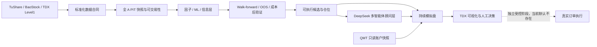

# QuantPilot-AI-Next

[简体中文](README.md) · [English](README.en.md)

[](https://github.com/Atlas2005/QuantPilot-AI-Next/actions/workflows/ci.yml)


> 面向中国 A 股的、盈利证据优先的 AI 量化研究与人工决策支持平台。项目将真实数据、A 股交易约束、可复现实验、AI 多智能体分析、持续模拟盘和 Windows/通达信工作流连接在同一套可审计边界内。

**状态更新时间：2026-08-15。** 项目已远超早期骨架阶段，但仍是研究、模拟盘与人工决策支持系统，不是已证明盈利的自动实盘产品。开发在 2026-08-03 的运行时稳定性检查点暂停，恢复顺序见[当前状态](docs/CURRENT_PROJECT_STATE.md)。

## 项目要解决什么

QuantPilot-AI-Next 的目标不是制造一个看起来复杂的“AI 炒股机器人”，而是建立一条能被验证、否证和复现的 A 股决策链：

1. 获取并标准化真实 A 股数据，同时保留时间点（PIT）和数据来源证据。
2. 显式建模 T+1、100 股手数、涨跌停、停牌、费用、滑点、流动性和账户约束。
3. 用样本外、滚动前推、成本后收益和消融实验筛选因子、模型与策略。
4. 通过 Qlib、VectorBT、RQAlpha 等成熟框架的适配或对照降低自建回测偏差。
5. 让 DeepSeek 多智能体承担结构化研究与风险意见，但保留确定性降级路径、调用预算和完整审计。
6. 将合格候选送入持续模拟盘、通达信可视化和人工执行流程；真实下单必须属于独立、受控、可回滚的后续阶段。

## 当前状态：三层必须分清

| 层级 | 分支 / 检查点 | 状态 | 结论 |
|---|---|---|---|
| GitHub 默认基线 | `main`，功能基线 `8c232f2` | 已合并，CI 覆盖 | 公开入口；包含截至 PR #130 的研究、数据、模拟盘、Windows、QMT 只读桥和 TDX Level1 能力 |
| 已完成的下一功能基线 | `feat/tdx-prediction-integration-v1`，`3e76235` | 15 个后续功能/修复提交；已实现并测试，尚未合入 `main` | 增加 TDX 预测回放/实时影子、训练概率、人机体验、全 A 日度生产输入、七桌 DeepSeek 和人工交易系统 |
| 暂停前 WIP | `fix/tdx-runtime-stability-v1`，`baf992c` | 最新检查点；**等待代码复核和 Windows 验收** | 增加单实例锁、重连抑制、干净退出、TQ 空参数和 TDX V6.06 公式兼容修复；不得当成正式发布 |

最新 WIP 检查点的本地完整测试证据为 **2170 passed, 6 skipped**。这证明测试套件通过，不证明策略盈利，也不替代 Windows 实机验收、长周期模拟盘或样本外收益证据。

## 已完成内容

### 1. 数据与 A 股市场现实

- TuShare 主数据路径，BaoStock 降级/交叉验证路径，以及通达信 Level1 实时行情适配器。
- 全 A 股 Parquet 快照、原子写入、分区校验、交易日历、PIT 上市日期和历史代码变更处理。
- 停牌、涨跌停、ST、成交量、价格和可交易性元数据富化。
- A 股 T+1、手数、费用、印花税、滑点、流动性、持仓和账户约束。
- 数据提供商失败、延迟、陈旧数据和来源证据的显式验证。

### 2. 研究、因子与验证

- 确定性因子排名、成本后基线、换手率优化、ML 因子训练和鲁棒性滚动前推。
- 样本外/Walk-forward、消融、基准对照、归因和可盈利性冒烟验证。
- Qlib 信号集成与离线工作流试验、VectorBT 回放对照、RQAlpha A 股适配审查。
- 可执行候选层、可交易性筛选、成本估算、仓位计算和填单模拟。

### 3. AI 决策与反馈闭环

- DeepSeek 多智能体合同、运行时路由、结构化 JSON 证据、调用次数与成本上限。
- 公告/信息层、研究委员会、量化公司角色编排以及 AI 增量消融。
- 多日模拟回放、日度评估、持续模拟盘、PostgreSQL/Prefect/Grafana 控制中心。
- AI 目前主要用于顾问/影子决策；确定性候选不会因模型失败被静默清空。

### 4. Windows、通达信与券商边界

- 可重复执行的 Windows 运行节点引导、DPAPI 密钥、Runtime Doctor 和生命周期脚本。
- QMT 内置 Python **只读**账户/持仓/订单/成交快照桥；默认不启用券商提供商。
- 通达信手工信号桥、QPTY/`QP候选` 板块发布和 Level1 实时订阅。
- 下一功能基线已实现 TDX 预测回放、实时影子、人机标记与盘后/盘中/收盘三段式人工交易工作流。

## 尚未完成，不能误报

- **没有可信的盈利证明。** 单日 holdout、测试通过或回测曲线都不能替代长期、样本外、成本后证据。
- **最新 TDX 运行时稳定性修复尚未完成 Windows 验收，也尚未合入默认分支。**
- **没有默认开启的自主实盘下单链路。** `main` 中的 QMT 桥是只读边界；任何订单写入都必须单独评审。
- 还没有正式版本标签或 GitHub Release；当前适合研究者和审阅者，不适合以稳定 SDK/产品依赖。
- 仓库目前没有明确许可证文件；在许可证确定前，不应推定任意商业再分发权利。

## 系统结构



核心原则是：模型不能绕过数据合同、A 股规则、验证门槛、调用预算或人工/券商边界。

## 快速开始

### 1. 克隆并运行基础测试

```bash
git clone https://github.com/Atlas2005/QuantPilot-AI-Next.git
cd QuantPilot-AI-Next
python3.11 -m venv .venv
source .venv/bin/activate
python -m pip install --upgrade pip
python -m pip install -e ".[dev]"
python -m pytest -q
```

Windows PowerShell 中激活虚拟环境：

```powershell
py -3.12 -m venv .venv
.\.venv\Scripts\Activate.ps1
python -m pip install --upgrade pip
python -m pip install -e ".[dev]"
python -m pytest -q
```

### 2. 按用途安装可选能力

| 用途 | 安装命令 | 外部要求 |
|---|---|---|
| 全 A 股快照 | `python -m pip install -e ".[all-a-share]"` | 真实拉取需要环境变量 `TUSHARE_TOKEN` |
| VectorBT 回放 | `python -m pip install -e ".[replay]"` | 使用本地/已授权数据 |
| ML 评估 | `python -m pip install -e ".[ml]"` | LightGBM |
| 持续模拟盘 | `python -m pip install -e ".[continuous-paper]"` | PostgreSQL / Prefect；完整 Windows 方案可用 Docker |
| Windows 节点 | `python -m pip install -e ".[windows-runtime]"` | Windows 64 位、Python 3.12；按需使用通达信/QMT |

`live-ai` 安装组和经过验证的真实 DeepSeek HTTP 调用位于尚未合并的 `feat/tdx-prediction-integration-v1`；切换到该固定检查点并阅读分支内人工系统文档后，才可安装 `.[live-ai]`。所有真实数据、模型和券商凭据只允许通过环境变量或本地加密运行时文件提供。不要把 token、账号、快照或生成的运行数据提交到 Git。

### 3. 先发现入口，再接真实数据

```bash
python scripts/run_factor_ranking_baseline_v1.py --help
python scripts/run_real_data_walk_forward_smoke.py --help
python scripts/run_real_candidate_daily_paper_v1.py --help
python scripts/run_continuous_paper_cycle_v1.py --help
python scripts/all_a_share_snapshot_v1.py --help
```

仓库不会附带可公开分发的真实市场数据。先运行测试和 fixture 路径，再按照各脚本的 `--help` 与相应文档显式启用真实数据。

### 4. Windows 运行节点

先执行不改状态、也不调用数据商的环境校验：

```powershell
powershell -NoProfile -ExecutionPolicy Bypass -File .\scripts\bootstrap_windows_runtime_v1.ps1 -ValidateOnly -NonInteractive -SkipDocker
```

确认要求后，再遵循 [Windows Runtime](docs/windows_runtime.md) 完成隔离运行目录、Docker 服务、DPAPI 密钥、TDX 或 QMT 只读桥配置。

### 5. 评审最新人工系统

该工作流尚未进入默认分支。评审者应固定到已完成的功能检查点；不要直接把 WIP 当作发布版：

```bash
git fetch origin --prune
git switch feat/tdx-prediction-integration-v1
git rev-parse --short HEAD   # 应为 3e76235
```

随后阅读该分支中的 `docs/quantpilot_manual_system_v1.md`。只有在复核运行时补丁并完成 Windows 单实例及短盘中验收后，才应测试 `fix/tdx-runtime-stability-v1`。

## 下一步

按顺序执行，不能跳级：

1. 复核 `fix/tdx-runtime-stability-v1`，运行 Windows 单实例 smoke 和短时盘中验收。
2. 验收通过后才合并最新运行时分支，并重新跑 Linux/Windows CI。
3. 扩大时间跨度与市场状态覆盖，积累不可回看调参的模拟盘/holdout 证据。
4. 用成本后收益、最大回撤、换手、命中率、稳定性和基准超额作为晋级指标。
5. 只有样本外和运行稳定性证据同时通过，才讨论小资金、人工批准、硬限额的独立资本测试阶段。

主停止条件：发现数据泄漏、成本后无优势、回撤超过预设阈值、数据/运行时不稳定、模型无法审计或任何越过人工与券商边界的路径。

## 文档入口

- [当前项目状态](docs/CURRENT_PROJECT_STATE.md)
- [Windows 运行节点](docs/windows_runtime.md)
- [项目定位](docs/PROJECT_POSITIONING.md)
- [成功指标](docs/SUCCESS_METRICS.md)
- [A 股市场规则](docs/A_SHARE_MARKET_RULES.md)
- [盈利优先集成架构](docs/PROFIT_FIRST_INTEGRATION_ARCHITECTURE.md)
- [开源替代策略](docs/OPEN_SOURCE_REPLACEMENT_STRATEGY.md)
- [路线图（历史阶段定义）](docs/QUANTPILOT_AI_2_0_ROADMAP.md)

## 风险声明

本项目不构成投资建议。研究结果、AI 输出、历史回放、模拟成交和通过测试都不等于未来收益。默认使用研究、回放、模拟盘或人工决策模式；在独立的资本就绪审查完成前，不应连接真实资金执行路径。
