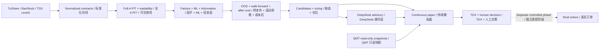

# QuantPilot-AI-Next

[**English — Full Guide**](README.en.md) · [**简体中文 — 完整文档**](README.zh-CN.md)

[](https://github.com/Atlas2005/QuantPilot-AI-Next/actions/workflows/ci.yml)


> **English:** A profit-evidence-first AI quant research and manual decision-support platform for China A-shares. QuantPilot connects point-in-time data, realistic market constraints, walk-forward evaluation, DeepSeek multi-agent analysis, continuous paper trading, and Windows/TongDaXin workflows behind auditable boundaries.

> **中文：** 面向中国 A 股的、盈利证据优先的 AI 量化研究与人工决策支持平台。QuantPilot 将时间点数据、真实交易约束、滚动前推验证、DeepSeek 多智能体、持续模拟盘和 Windows/通达信工作流连接在可审计边界内。

**Status / 状态：2026-08-15 — Advanced research, paper trading, and manual decision support; not proven profitable and not autonomous live trading. / 高级研究、模拟盘与人工决策支持阶段；尚未证明盈利，也不是自主实盘系统。**

## Project snapshot / 项目快照

| | English | 中文 |
|---|---|---|
| Market / 市场 | China A-shares | 中国 A 股 |
| Core / 核心 | PIT data, A-share constraints, OOS/walk-forward, after-cost evaluation | PIT 数据、A 股约束、样本外/滚动前推、成本后评估 |
| AI / 人工智能 | DeepSeek multi-agent advisory with budgets, fallbacks, and audit trails | 带预算、降级路径和审计记录的 DeepSeek 多智能体顾问层 |
| Operations / 运行 | Continuous paper, Windows runtime, TDX visualization, QMT read-only bridge | 持续模拟盘、Windows 节点、TDX 可视化、QMT 只读桥 |
| Verified / 验证 | `main`: 1986 passed, 6 skipped; latest checkpoint: 2170 passed, 6 skipped | `main`：1986 通过、6 跳过；最新检查点：2170 通过、6 跳过 |
| Safety / 安全 | No autonomous live-order route enabled by default | 默认不启用自主实盘下单路径 |

## Why this project exists

Most quant repositories optimize for an attractive backtest. QuantPilot is designed around the harder problem: whether an A-share decision process survives point-in-time data, T+1, lot sizes, suspensions, price limits, fees, slippage, liquidity, account constraints, model failures, and out-of-sample testing.

The target pipeline is:

1. Normalize real A-share data with provenance and point-in-time evidence.
2. Enforce realistic market, execution, capital, and account constraints.
3. Compare deterministic factors, ML ranking, and mature research frameworks.
4. Promote candidates only through OOS, walk-forward, benchmark, ablation, and after-cost evidence.
5. Use AI as a structured, budgeted, auditable decision layer—not as a bypass around evidence.
6. Deliver qualified candidates to paper trading and human review before any separately approved capital phase.

## 为什么做这个项目

多数开源量化项目优先展示漂亮的回测曲线。QuantPilot 解决的是更难的问题：一套 A 股决策流程能否经受 PIT 数据、T+1、整手、停牌、涨跌停、费用、滑点、流动性、账户约束、模型失败和样本外验证。

目标链路是：

1. 标准化真实 A 股数据并保留来源和时间点证据。
2. 强制执行真实市场、成交、资金和账户约束。
3. 对照确定性因子、ML 排名和成熟研究框架。
4. 只有通过 OOS、滚动前推、基准、消融和成本后证据的候选才能晋级。
5. AI 是结构化、有预算、可审计的决策层，不能绕过证据。
6. 合格候选先进入模拟盘和人工复核，真实资金必须属于单独批准的阶段。

## What is implemented / 已完成内容

### English

- TuShare primary paths, BaoStock fallback/cross-validation, TDX Level1, and full-A Parquet/PIT snapshots.
- Tradability metadata and A-share T+1, lot-size, suspension, price-limit, fee, slippage, liquidity, position, and account rules.
- Deterministic factor ranking, ML factor training, turnover optimization, walk-forward/OOS evaluation, benchmarks, ablation, and attribution.
- Optional Qlib, VectorBT, and RQAlpha adapter/evaluation work.
- Executable-candidate filtering, cost and sizing, fill simulation, paper ledger, daily evaluation, and continuous paper operation.
- DeepSeek multi-agent contracts, information/research roles, bounded runtime routing, and shadow/advisory integration.
- Windows bootstrap, DPAPI secrets, PostgreSQL/Prefect/Grafana control center, Runtime Doctor, TDX bridge, and QMT read-only snapshots.

### 中文

- TuShare 主路径、BaoStock 降级/交叉验证、TDX Level1 和全 A 股 Parquet/PIT 快照。
- 可交易性元数据，以及 T+1、整手、停牌、涨跌停、费用、滑点、流动性、持仓和账户规则。
- 确定性因子排名、ML 因子训练、换手优化、Walk-forward/OOS、基准、消融和归因。
- Qlib、VectorBT、RQAlpha 的可选适配与评估工作。
- 可执行候选筛选、成本和仓位、填单模拟、模拟账本、日度评估和持续模拟盘。
- DeepSeek 多智能体合同、信息/研究角色、受预算约束的运行时路由和影子顾问集成。
- Windows 引导、DPAPI 密钥、PostgreSQL/Prefect/Grafana 控制中心、Runtime Doctor、TDX 桥和 QMT 只读快照。

## Branch status / 分支状态

| Layer / 层级 | Ref | Status / 状态 |
|---|---|---|
| Public baseline / 公开基线 | `main` · functional baseline `8c232f2` | Merged through PR #130 and covered by CI / 已合并至 PR #130 并由 CI 覆盖 |
| Completed next feature / 已完成下一功能基线 | `feat/tdx-prediction-integration-v1` · `3e76235` | TDX prediction, daily full-A input, seven DeepSeek desks, and manual workflow; not merged / 已实现 TDX 预测、全 A 日度输入、七桌 DeepSeek 和人工流程，尚未合并 |
| Paused WIP / 暂停前 WIP | `fix/tdx-runtime-stability-v1` · `baf992c` | Awaiting code review and real Windows/TDX acceptance / 等待代码复核和真实 Windows/TDX 验收 |

The WIP branch must not be represented as a release. Full evidence and the resume sequence are in [Current Project State](docs/CURRENT_PROJECT_STATE.md). / WIP 分支不得被包装成正式发布；完整证据和恢复顺序见[当前项目状态](docs/CURRENT_PROJECT_STATE.md)。

## Architecture / 系统结构



## Five-minute verification / 五分钟验证

```bash
git clone https://github.com/Atlas2005/QuantPilot-AI-Next.git
cd QuantPilot-AI-Next
python3.11 -m venv .venv
source .venv/bin/activate
python -m pip install --upgrade pip
python -m pip install -e ".[dev]"
python -m pytest -q
```

Windows PowerShell:

```powershell
py -3.12 -m venv .venv
.\.venv\Scripts\Activate.ps1
python -m pip install --upgrade pip
python -m pip install -e ".[dev]"
python -m pytest -q
```

Explore the main entry points / 查看主要入口：

```bash
python scripts/run_factor_ranking_baseline_v1.py --help
python scripts/run_real_data_walk_forward_smoke.py --help
python scripts/run_real_candidate_daily_paper_v1.py --help
python scripts/run_continuous_paper_cycle_v1.py --help
python scripts/all_a_share_snapshot_v1.py --help
```

## Full documentation / 完整文档

| English | 中文 |
|---|---|
| [Full English README](README.en.md) | [完整中文 README](README.zh-CN.md) |
| [Current project state](docs/CURRENT_PROJECT_STATE.md) | [当前项目状态](docs/CURRENT_PROJECT_STATE.md) |
| [Windows runtime](docs/windows_runtime.md) | [Windows 运行节点](docs/windows_runtime.md) |
| [Project positioning](docs/PROJECT_POSITIONING.md) | [项目定位](docs/PROJECT_POSITIONING.md) |
| [Success metrics](docs/SUCCESS_METRICS.md) | [成功指标](docs/SUCCESS_METRICS.md) |

## Before using real data or capital / 使用真实数据或资金前

- This repository contains no redistributable real-market dataset. Provider credentials must stay in environment variables or encrypted local runtime files.
- Passing tests, AI output, historical replay, simulated fills, and a one-day holdout do not prove future profitability.
- There is no autonomous live-order route enabled by default. Any order-writing or capital-test path requires a separate review, hard limits, and human approval.
- The repository currently has no explicit license file. Do not assume unrestricted commercial redistribution rights.

- 仓库不附带可公开再分发的真实市场数据。数据商凭据只能保存在环境变量或本地加密运行时文件中。
- 测试通过、AI 输出、历史回放、模拟成交和单日 holdout 都不能证明未来盈利。
- 默认不存在自主实盘下单路径。任何订单写入或资金测试都必须单独评审、设置硬限额并由人工批准。
- 仓库目前没有明确许可证文件，不能推定拥有不受限制的商业再分发权利。

## Follow or contribute / 关注或参与

If the project is useful, star it to follow progress, share the repository with A-share/quant practitioners, or open an issue with a reproducible question, dataset contract, framework comparison, or runtime failure. / 如果项目对你有价值，可以通过 Star 关注进展、分享给 A 股或量化研究者，或者提交带复现步骤的问题、数据合同、框架对照或运行时故障。

This project is not financial advice. / 本项目不构成投资建议。
